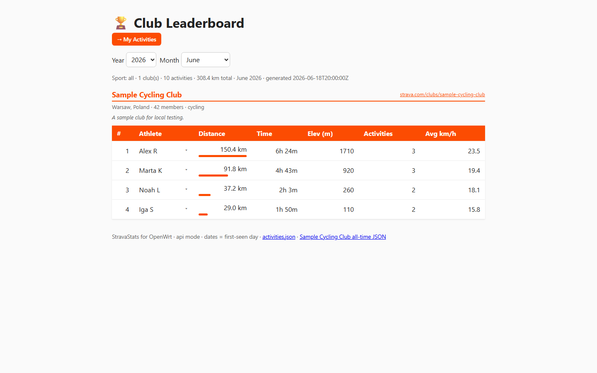
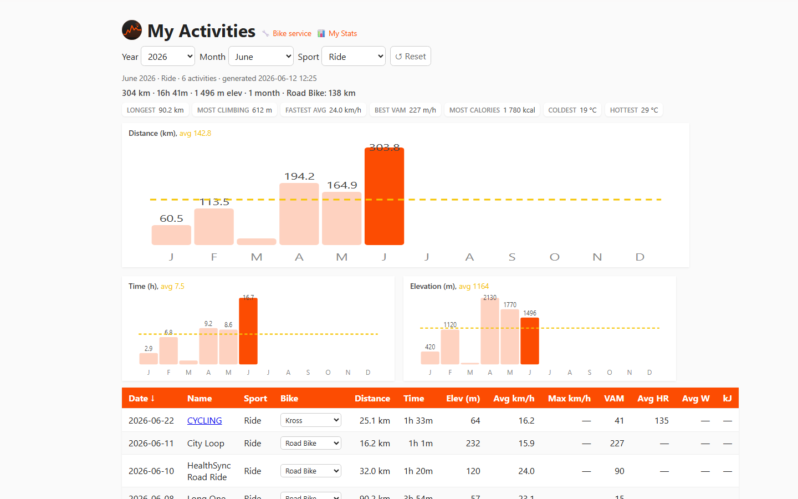
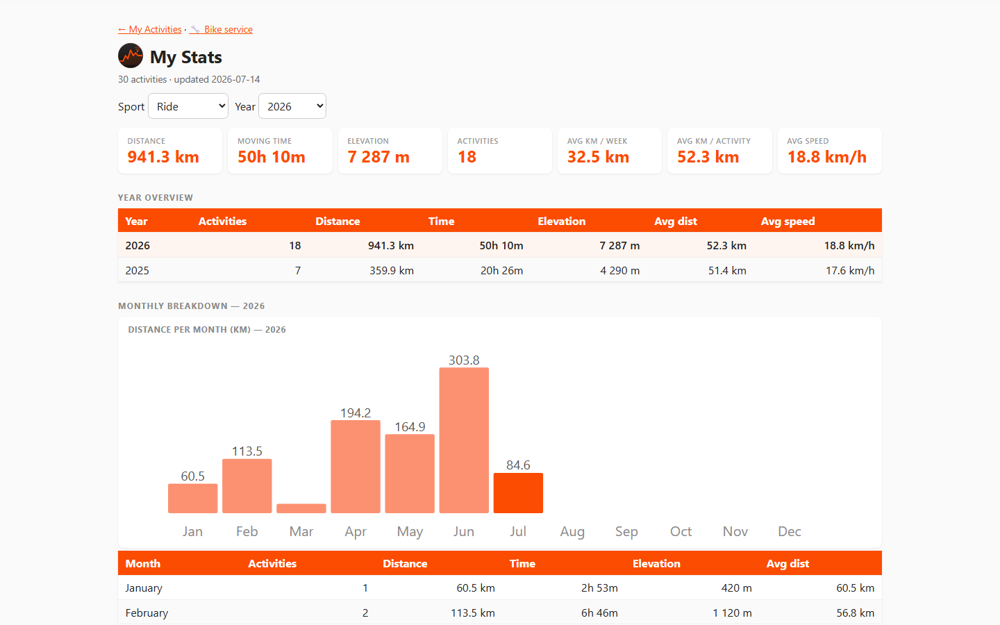
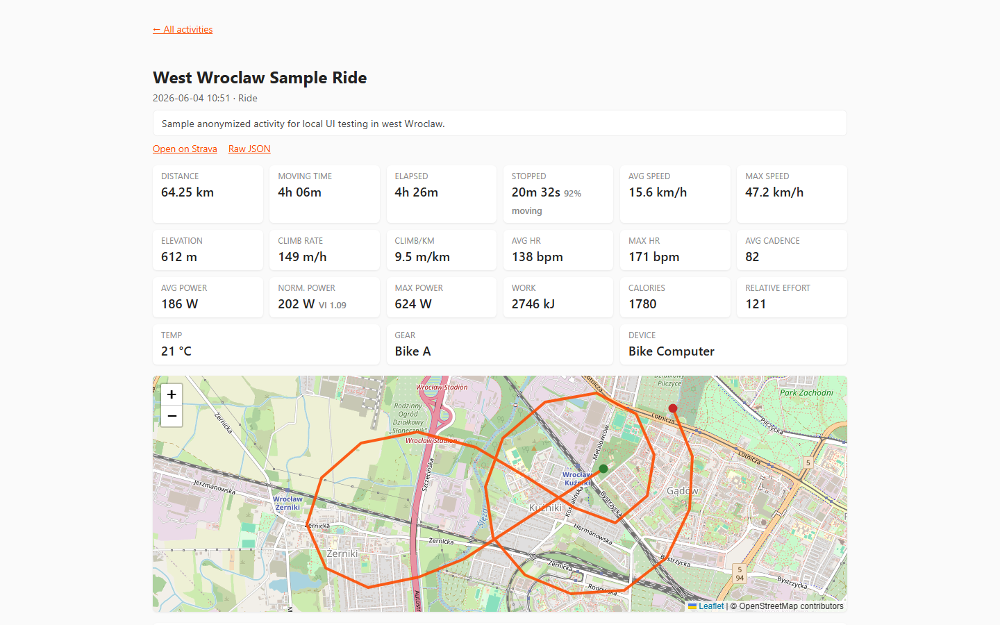
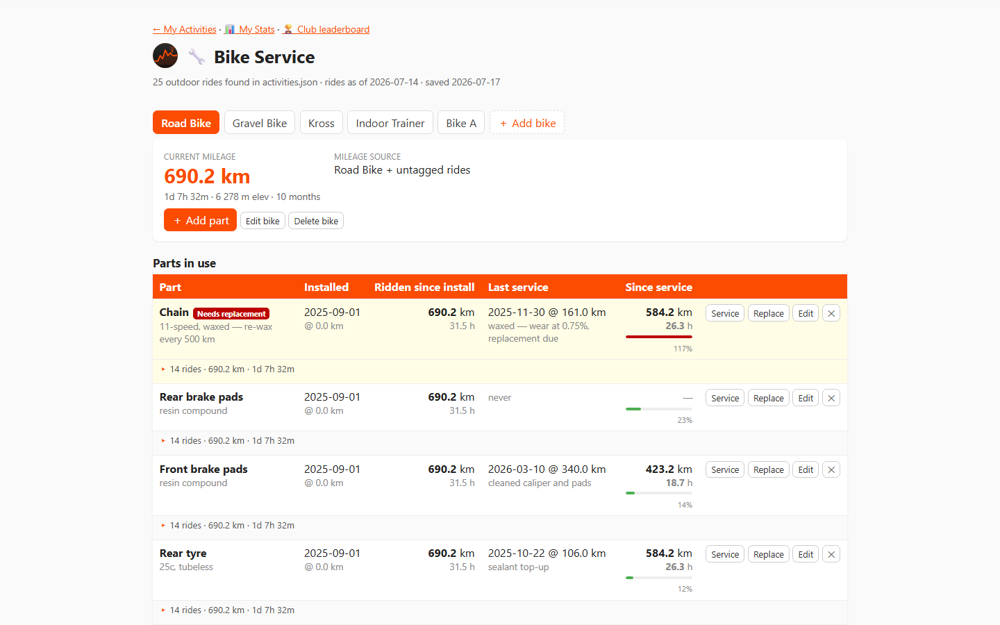

# StravaStats for OpenWrt
[](https://github.com/raczeja/StatsServiceBook/actions/workflows/ci.yml)

A router-native activity stats and bike service tracker for OpenWrt — club leaderboard, personal activity dashboard, per-activity detail with route map, personal stats, and a bike service tracker with mileage and service alerts. Supports Strava as the primary source, and also works with [HealthSync](https://healthsync.app/)-exported CSV/GPX/TCX files from Google Drive for Strava-API-free use. Runs entirely on the router: no cloud, no extra server, no RAM daemon. Can also run locally via **Docker** or **Windows WSL**.

This is a single POSIX shell script driven by **cron**, using **`curl`** to talk to the
Strava API or Google Drive + HealthSync exports and **`jq`** to aggregate. The result is written as a static HTML page
(plus JSON) into **uhttpd's** web root, so the router's built-in web server serves
it with no extra daemon and almost no RAM.

> **No Strava subscription?** Strava's read API is restricted to paying subscribers. As a workaround, you can use [healthsync.app](https://healthsync.app/) on Android — it syncs activities from Huawei Health, Fitbit, Garmin, and others and exports them (CSV + GPX/TCX) to a Google Drive folder. Switch cron to `healthsync-activities.sh` and it downloads those files instead of calling the Strava API, giving you the same dashboard pages with full route maps. See [§ Switching from Strava to HealthSync](#switching-from-strava-to-healthsync-keeping-full-history) for setup.

### What it gives you

| Page                 | URL                        | What it shows                                                                                              |
| -------------------- | -------------------------- | ---------------------------------------------------------------------------------------------------------- |
| **Club leaderboard** | `/strava/`                 | Monthly/yearly distance ranking for your Strava club — filterable by year and month                        |
| **My Activities**    | `/strava/me/`              | All your activities in a sortable table with year/month/sport filters, bests strip, and monthly bar charts |
| **Activity detail**  | `/strava/me/activity.html` | Per-activity stats cards, interactive route map (Leaflet + OSM), and per-km splits chart                   |
| **Personal stats**   | `/strava/me/stats.html`    | Aggregate KPIs, year-over-year heatmap, personal records, sport breakdown, and day-of-week chart           |
| **Bike service**     | `/strava/me/bike.html`     | Maintenance log per bike: add parts, record service dates, track mileage auto-computed from your rides     |

Everything runs on the router or docker container. The browser fetches a static JSON file and renders all charts and filters client-side — no server-side processing after the nightly cron.

```
cron (23:50) ──► strava-leaderboard.sh
                   │  STRAVA_SOURCE=api (default; Club API deprecated 2026-09-01):
                   │    1. refresh OAuth access token (curl)
                   │    2. page /clubs/{id}/activities feed (curl)
                   │       dedupe by content signature, stamp firstSeen = today
                   │  STRAVA_SOURCE=scrape (switch after 2026-09-01):
                   │    1. verify _strava4_session cookie + CSRF token
                   │    2. page /clubs/{id}/feed endpoint (curl, cursor pagination)
                   │       dedupe by Strava activity ID, real activity dates
                   │  3. merge into activity store (jq, NDJSON, same format both modes)
                   │  4. emit activities.json + all-time leaderboard.json (+ snapshot)
                   └► 5. render static /www/strava/index.html
                                    │
   browser on LAN ◄── uhttpd ◄──────┘   http://<router-ip>/strava/
                   │
                   └─ page fetches activities.json and filters by year/month
                      (defaulting to the current month) entirely in the browser

cron (23:55) ──► strava-my-activities.sh          ← Strava API (active while subscribed)
                   │  1. refresh access token (curl)
                   │  2. page /athlete/activities feed (curl)
                   │       real Strava IDs + real dates (start_date_local)
                   │  3. merge into activity store (jq)
                   │       dedupe by Strava activity ID — no approximation
                   └► 4. render static /www/strava/me/{index,activity,stats,bike}.html

             — OR —

cron (23:55) ──► healthsync-activities.sh         ← Google Drive (Strava-API-free)
                   │  1. refresh Google OAuth token (curl)
                   │  2. list Drive folder, find new CSV/GPX/TCX files
                   │  3. parse CSV (summary), TCX (HR/calories), GPX (map + elevation)
                   │       GPX files cached locally; map rendered in-browser via Leaflet polyline
                   └► 4. render the same /www/strava/me/{index,activity,stats,bike}.html
                                    │
   browser on LAN ◄── uhttpd ◄──────┘   http://<router-ip>/strava/me/
                   │
                   ├─ index.html  — sortable table + monthly bar charts
                   ├─ activity.html — per-activity detail (map, splits)
                   ├─ stats.html  — KPIs, year comparison, records, DOW chart
                   └─ bike.html   — bike service tracker (reads/writes via CGI)
```

## Screenshots

|                     Club dashboard                     |
| :----------------------------------------------------: |
|  |

|               My Activities dashboard                |         Personal stats summary          |
| :--------------------------------------------------: | :-------------------------------------: |
|  |  |

|              Activity detail (map + splits)              |                Bike service tracker                |
| :------------------------------------------------------: | :------------------------------------------------: |
|  |  |

> Screenshots generated from sample data via `powershell -File test/make-screenshots.ps1`.

## Features

- Just `sh` + `curl` + `jq`.
- You authorize once on your PC and store a
  long-lived refresh token in a config file; the script refreshes the access
  token itself on every run (and persists the rotated refresh token).
- **Accumulating activity store + month/year filtering (club leaderboard).**
  Strava's `/clubs/{id}/activities` feed returns **no dates and no activity
  IDs** — it's just the club's _recent_ activities. So each daily run merges
  the feed into a persistent store (`activities.ndjson`), deduping by a content
  signature and stamping every newly seen activity with **today's date** as its
  "first seen" day. With a daily cron and a feed that spans ~2 weeks, that date
  tracks the performed day to within the polling interval — enough to **filter
  the dashboard by year and month** (defaulting to the current month), which the
  live app and earlier versions of this script couldn't do.
- **My Activities dashboard (individual athlete).** The
  `/athlete/activities` endpoint returns full activity objects with real Strava
  IDs and real dates (`start_date_local`), so **no first-seen approximation is
  needed**. Activities are deduped by Strava ID, not content signature. The
  resulting dashboard offers year/month/sport-type filters, a sortable table
  (distance, time, elevation, avg/max speed, **VAM** climb rate, avg HR, avg
  power, work in kJ), a period **"bests"** strip (longest ride, most climbing,
  fastest avg, best VAM, most work), and monthly bar charts for distance, time,
  and elevation — all rendered client-side from a single JSON file. The
  power/HR/VAM columns are populated for activities that carry that data (e.g.
  rides with a power meter) and show "—" otherwise.
- **Per-activity detail backfill (My Activities).** Beyond the summary feed,
  each run also fetches the _full_ activity object (`GET /activities/{id}`) for
  activities that don't yet have one and saves it as `<id>.json` under
  `STRAVA_MY_DETAIL_DIR` (default `…/details/`). Because Strava's read API is
  rate limited (default 100 req / 15 min, 1000 / day for a non-premium app), it
  fetches at most `STRAVA_MY_DETAIL_MAX_PER_RUN` new files per run (newest
  first), so the whole history backfills gradually over successive daily cron
  runs and new activities are picked up the next day. Activities Strava reports
  gone (HTTP 404/410) are recorded in a skip list and not retried.
- **Historical sync (My Activities).** The store isn't merely appended to — each
  run reconciles it against the feed, so changes you make on Strava show up
  locally: a renamed ride, a corrected sport type or a recalculated distance/time
  are refreshed in place, and an activity you delete on Strava is pruned from the
  dashboard (its cached detail file removed too, and changed activities have their
  detail re-fetched). Deletion is conservative — it only happens when the run
  reached the end of your feed, or, on a run capped at `STRAVA_MY_MAX_PAGES`, for
  activities inside the date window actually fetched; an empty feed never prunes.
  Set `STRAVA_MY_PRUNE_DELETED=0` to keep deletions disabled (additions and
  in-place updates still apply).
- **Activity detail page (My Activities).** Once an activity has its detail
  file, its name in the dashboard links to `activity.html?id=<id>` — a readable
  detail page (instead of raw JSON) rendered client-side from that same
  `<id>.json`. It shows core-stat cards (distance, time, stopped time,
  pace/speed, elevation, **VAM** climb rate, climb per km, heart rate, cadence,
  power including **normalized power + variability index**, work in kJ, calories,
  relative effort, temperature, gear), an interactive **route map**
  (Leaflet + OpenStreetMap), and a **per-km splits** bar chart. Cycling-specific
  metrics (VAM, power, work) appear
  only when the activity carries that data. The map needs
  internet **in the viewing browser** (Leaflet + tiles load from a CDN); the
  rest of the page works offline. A "Raw JSON" link and "Open on Strava" link
  are still provided.
- **Personal stats summary (My Activities).** A separate page at
  `http://<router-ip>/strava/me/stats.html` (linked from the My Activities
  header) with sport/year filters and: aggregate KPI cards (distance, time,
  elevation, activities, avg speed), a year overview table, a monthly breakdown
  bar chart + table, a year-over-year km-per-month heatmap, personal records
  (longest, most climbing, fastest avg, best VAM, most work — all time for the
  selected sport), a by-sport breakdown, and an average-distance-per-day-of-week
  bar chart. All computed client-side from `activities.json`.
- **Club leaderboard scrape mode (STRAVA_SOURCE=scrape).** Strava's `/clubs/{id}/activities` API endpoint is deprecated **effective 2026-09-01**. Set `STRAVA_SOURCE=scrape` in the config to switch to a web-session-based feed that calls the Strava club feed endpoint directly — no OAuth app required. Scrape mode gives **real activity dates and Strava IDs** (not first-seen approximations). Paste your browser's `_strava4_session` cookie from DevTools → Application → Cookies → strava.com; sessions last ~30 days and the script tells you when to refresh. The NDJSON store format is identical between both modes, so switching is non-destructive. See [§ Switching to scrape mode after September 2026](#switching-to-scrape-mode-after-september-2026) for step-by-step instructions.

- **HealthSync / Google Drive data source.** A drop-in replacement for the Strava
  API. [healthsync.app](https://healthsync.app/) runs on Android or iPhone and exports
  activities to Google Drive as CSV + GPX + TCX files. `healthsync-activities.sh`
  downloads those files, parses them with `curl` + `jq` + `grep`, and produces the
  exact same `activities.json` and HTML pages as `strava-my-activities.sh`. GPX
  files are cached locally and rendered in-browser via Leaflet polyline (same as
  the Strava encoded-polyline path). Switching is as simple as changing which script cron runs.
  Strava activity IDs are numeric; HealthSync IDs are date-based strings like
  `2026-06-22-20-01-ride` — all pages handle both transparently.

- **Bike service tracker (My Activities).** A separate page at
  `http://<router-ip>/strava/me/bike.html` (linked from the My Activities footer)
  for tracking bike maintenance per part — chain, tyres, brake pads, cables, etc.

  **Mileage from Strava.** Every mileage figure on this page is computed live in
  the browser from your `activities.json`: cumulative distance of outdoor `Ride`
  activities up to a chosen date. A calendar picker (default today) lets you pick
  any date and the mileage **auto-recomputes** instantly — no manual entry. Map a
  bike to a Strava **gear** and only that bike's rides count toward its mileage;
  leave it unmapped and all rides are attributed to it.

  **Parts & service history.** Each part records the date it was fitted and the
  bike's mileage at that moment. You can **service** a part (logs a date + current
  mileage + free-text note) and **replace** it: the old part moves to an
  **Archived** section with its final mileage, and optionally a successor is fitted
  on the same day.

  **Service alerts.** Each part can have an optional **km threshold** and/or
  **hours threshold** (riding time since the last service or install). Once a part
  exceeds its threshold its row is **highlighted in yellow** as a visual reminder
  that it is due for service. For example: chain → 2 000 km, tyres → 5 000 km,
  brake pads → 3 000 km. Thresholds are per-part and editable at any time.

  **Multiple bikes.** Track as many bikes as you like; each is a separate tab.
  The initial bike name is configurable via `STRAVA_MY_DEFAULT_BIKE_NAME` and is
  used only as a seed when no bikes are stored yet.

  **Writes data back.** Unlike every other page here this one saves data: it reads
  and writes a single `bike-service.json` through a tiny POSIX-sh **CGI** that
  `strava-my-activities` installs to `STRAVA_MY_CGI_DIR` (uhttpd's `/www/cgi-bin`,
  served as CGI by default). The CGI is the only writer of the data file, so daily
  cron runs that regenerate the page never touch your data. There is **no auth** —
  same open-on-the-LAN posture as the other dashboards; intended for a private
  home router only.

## Running locally (Docker / WSL)

The app can run on your local machine — either with sample data for a quick UI preview, or with your real Strava credentials as a personal dashboard on any PC.

### Quick preview with sample data (no Strava credentials needed)

The test container serves all five pages from bundled sample data. Nothing to configure.

**Prerequisites:** Docker or Podman installed.

**Build and start:**

```sh
# From the repo root
podman build -f test/Containerfile -t stravame-test .
podman run --rm -p 8080:8080 stravame-test

# Or with Docker
docker build -f test/Containerfile -t stravame-test .
docker run --rm -p 8080:8080 stravame-test
```

**Open in a browser:**

- Club leaderboard: <http://localhost:8080/strava/index.html>
- My Activities dashboard: <http://localhost:8080/strava/me/index.html>
- Personal stats: <http://localhost:8080/strava/me/stats.html>
- Activity detail (map + splits): <http://localhost:8080/strava/me/activity.html?id=18784255013>
- Bike service tracker: <http://localhost:8080/strava/me/bike.html>

**Test data:** `test/activities.sample.json` (24 rides), `test/club-activities.sample.json` (10 club activities), `test/bike-service.sample.json` (3 bikes), `test/18784255013.json` (full activity detail). All synthetic/anonymized — no personal data.

**Run functional regression tests:**

```powershell
powershell -ExecutionPolicy Bypass -File .\test\run-tests.ps1
```

Builds the image, runs Puppeteer assertions across all five pages and the bike-service CGI, exits 0 on pass. Requires Node.js ≥ 18 and PowerShell Core (`pwsh`) on Linux/macOS. On Linux, Puppeteer downloads and uses its bundled Chromium browser automatically.

If you need to force a specific host port for the container, set `STRAVA_TEST_PORT` before running the script.

**Generate screenshots:**

```powershell
powershell -ExecutionPolicy Bypass -File .\test\make-screenshots.ps1
```

Builds the image, captures all five pages with Puppeteer, saves PNGs to `test/screenshots/`. Requires Node.js ≥ 18 and PowerShell Core (`pwsh`) on Linux/macOS. `STRAVA_TEST_PORT` is also supported here if you want a fixed host port.

---

### Running with your real Strava data

#### Docker (from a Linux shell or WSL terminal)

From the repo root:

```sh
# 1. Copy the My Activities config and fill in your credentials + fix the state path
cp config-my.example my-activities.conf
```

Edit `my-activities.conf` and set:

- `STRAVA_CLIENT_ID`, `STRAVA_CLIENT_SECRET`, `STRAVA_REFRESH_TOKEN` — your Strava credentials (see §1–2 below)
- `STRAVA_MY_STATE_DIR="/state"` — change from the OpenWrt default
- `STRAVA_MY_BIKE_DATA="/state/bike-service.json"` — change from the OpenWrt default
- Leave all other paths (`WEB_DIR`, `CGI_DIR`, `DETAIL_DIR`) at their defaults

```sh
# 2. Fetch your activities and render HTML into named Docker volumes
docker run --rm \
  -v "$(pwd):/app:ro" \
  -e STRAVA_MY_CONFIG=/app/my-activities.conf \
  -v strava-state:/state \
  -v strava-web:/www \
  alpine:3.20 \
  sh -c "apk add --no-cache curl jq ca-certificates && sh /app/strava-my-activities.sh"

# 3. Serve — busybox httpd runs /www/cgi-bin as CGI so the bike tracker save button works
docker run --rm -p 8080:8080 \
  -v strava-web:/www \
  alpine:3.20 \
  sh -c "apk add --no-cache busybox-extras && httpd -f -p 8080 -h /www"

# Browse to http://localhost:8080/strava/me/
```

Re-run step **2** daily to keep the dashboard fresh (schedule with Task Scheduler or cron).

> **Windows PowerShell (without WSL):** replace `$(pwd)` with `${PWD}` and use a backtick `` ` `` for line continuation instead of `\`.

> **Club leaderboard:** same pattern — copy `config.example` to `strava-leaderboard.conf`, set credentials and `STRAVA_STATE_DIR="/state"`, then run `sh /app/strava-leaderboard.sh` with `-v strava-web:/www/strava` added. Browse to `http://localhost:8080/strava/`.

---

#### Docker — HealthSync / Google Drive (Strava-API-free)

Use this instead of (or after) the Strava variant above. Same pages, same URLs.

```sh
# 1. Copy the healthsync config and fill in your Google credentials
cp config-healthsync.example healthsync.conf
```

Edit `healthsync.conf` and set:

- `GOOGLE_CLIENT_ID`, `GOOGLE_CLIENT_SECRET`, `GOOGLE_REFRESH_TOKEN` — create a Desktop-app OAuth client in [Google Cloud Console](https://console.cloud.google.com/) (Drive API enabled, yourself as test user), then follow the device-flow steps in [config-healthsync.example](config-healthsync.example) to get a refresh token
- `DRIVE_FOLDER_ID` — the ID of the Drive folder where healthsync.app exports files
- `HEALTHSYNC_STATE_DIR="/state"` — change from the OpenWrt default
- `HEALTHSYNC_BIKE_DATA="/state/bike-service.json"`

```sh
# 2. Download activities from Drive, parse, and render HTML into named Docker volumes
docker run --rm \
  -v "$(pwd):/app:ro" \
  -e HEALTHSYNC_CONFIG=/app/healthsync.conf \
  -v healthsync-state:/state \
  -v strava-web:/www \
  alpine:3.20 \
  sh -c "apk add --no-cache curl jq ca-certificates && sh /app/healthsync-activities.sh"

# 3. Serve — same command as the Strava variant; reuse the same strava-web volume
docker run --rm -p 8080:8080 \
  -v strava-web:/www \
  alpine:3.20 \
  sh -c "apk add --no-cache busybox-extras && httpd -f -p 8080 -h /www"

# Browse to http://localhost:8080/strava/me/
```

Re-run step **2** daily. The script only downloads files not yet in the local store — incremental runs are fast.

> **Skip-import flag:** set `HEALTHSYNC_IMPORT_ENABLED=0` (in the config or as an env var) to skip the Google Drive download and just re-render the HTML from the existing local store. Useful for testing HTML changes without re-fetching. The equivalent for the Strava script is `STRAVA_MY_IMPORT_ENABLED=0`.

---

#### Windows (WSL — Windows Subsystem for Linux)

WSL gives you a full Linux environment on Windows — the scripts run directly with no container overhead.

**a. Install WSL2 (one-time, in PowerShell as Administrator):**

```powershell
wsl --install -d Ubuntu
```

Reboot if prompted, then open the Ubuntu app from the Start menu.

**b. Install dependencies:**

```sh
sudo apt update && sudo apt install -y curl jq
```

**c. Navigate to the repo (Windows drives are mounted under `/mnt/` in WSL):**

```sh
cd /mnt/c/CProjektyGIT/Git_OS/StatsServiceBook   # adjust to your clone path
```

**d. Create a config with your credentials and local paths:**

```sh
cp config-my.example ~/.strava-my.conf
nano ~/.strava-my.conf
```

Set the three required credentials and change the path lines so state lives in your home directory:

```sh
STRAVA_MY_WEB_DIR="$HOME/strava-web/strava/me"
STRAVA_MY_STATE_DIR="$HOME/strava-state"
STRAVA_MY_CGI_DIR="$HOME/strava-web/cgi-bin"
STRAVA_MY_BIKE_DATA="$HOME/strava-state/bike-service.json"
STRAVA_MY_DETAIL_DIR="$HOME/strava-web/strava/me/details"
```

**e. Create directories and run:**

```sh
mkdir -p ~/strava-state ~/strava-web/strava/me/details ~/strava-web/cgi-bin
STRAVA_MY_CONFIG="$HOME/.strava-my.conf" sh strava-my-activities.sh
```

The run ends with `done.` — see [§5 (Verify it ran)](#5-verify-it-ran-check-the-logs) for what healthy output looks like.

**f. Serve the output:**

```sh
python3 -m http.server 8080 --directory ~/strava-web
# Browse to http://localhost:8080/strava/me/
```

> **Bike service CGI:** Python's `http.server` does not execute CGI scripts, so the bike page's **Save** button won't work in this setup. Either use the Docker approach above (busybox httpd serves CGI natively), or install busybox in WSL (`sudo apt install busybox`) and serve with `busybox httpd -f -p 8080 -h ~/strava-web`.

**To keep the dashboard fresh**, add a cron job in WSL:

```sh
crontab -e
# Add this line (adjust path to your repo):
55 23 * * *  STRAVA_MY_CONFIG="$HOME/.strava-my.conf" sh /mnt/c/CProjektyGIT/Git_OS/StatsServiceBook/strava-my-activities.sh >> ~/strava-my-activities.log 2>&1
```

## Requirements

- OpenWrt 21.02+ on the router, SSH access as `root`.
- Free space for `curl`, `jq`, `ca-bundle` and their libs (~1–2 MB). On a tight
  128 MB flash device, consider [extroot / a USB drive](https://openwrt.org/docs/guide-user/additional-software/extroot_configuration)
  and point `STRAVA_STATE_DIR` at it.
- A Strava account that is a **member of the club** you want to rank.

**Using PowerShell (pwsh) in Codespaces**

- **Quick explanation:** GitHub Codespaces can run Ubuntu-based containers (here: Ubuntu 24.04). Some tests and helper tools (scripts in `test/`) use PowerShell (`pwsh`). If you want to have `pwsh` in a Codespaces/devcontainer environment, you can install it manually or add the installation to `devcontainer.json` `postCreateCommand`.

- **Manual installation in a Codespaces session (run in terminal):**

```sh
# Run as root or prefix with sudo
curl -fsSL https://packages.microsoft.com/config/ubuntu/24.04/packages-microsoft-prod.deb -o /tmp/packages-microsoft-prod.deb
sudo dpkg -i /tmp/packages-microsoft-prod.deb
rm -f /tmp/packages-microsoft-prod.deb
sudo apt-get update
sudo apt-get install -y --no-install-recommends powershell

# Start PowerShell
pwsh
```

- **Automatic installation after creating a Codespace (devcontainer):**

1. Add the file `scripts/install-pwsh-in-codespaces.sh` from the repository (you'll find it in `scripts/`).
2. In `devcontainer.json` set `postCreateCommand` to call this script, for example:

```json
"postCreateCommand": "bash /workspaces/StatsServiceBook/scripts/install-pwsh-in-codespaces.sh"
```

- **Helper script:** The included installation script is located here: [scripts/install-pwsh-in-codespaces.sh](scripts/install-pwsh-in-codespaces.sh#L1). It runs the addition of the Microsoft repository and installs the `powershell` package on Ubuntu 24.04.

## 1. Create a Strava API application

Your `CLIENT_ID` and `CLIENT_SECRET` come from a free Strava API application
(one per account). The account you use must be a **member of the club** you want
to rank.

1. Logged into Strava, go to <https://www.strava.com/settings/api>
   (or: profile → **Settings** → **My API Application**).
2. If you've never made one, fill in the form:
   - **Application Name** — anything, e.g. `RouterStats`
   - **Category** — anything, e.g. _Data Importer_
   - **Club** — leave blank
   - **Website** — anything valid, e.g. `http://localhost`
   - **Authorization Callback Domain** — **`localhost`** (must match the
     `redirect_uri=http://localhost` used in step 2)
   - Upload an image if asked, then **Create**.
3. The page now shows your credentials:
   - **Client ID** — a short number (e.g. `123456`) → `STRAVA_CLIENT_ID`
   - **Client Secret** — click _Show_ to reveal the long hex string → `STRAVA_CLIENT_SECRET`

> **Note:** Strava allows only **one API app per account** — if you already have
> one, just reuse its Client ID rather than creating a second. Keep the Client
> Secret private; it stays in the `chmod 600` config on the router, never in the
> web root.

These two values identify your _app_. To actually read the club feed you also
need a **refresh token** — get it via the one-time authorization in step 2 below
(which uses this same Client ID).

## 2. One-time authorization (get a refresh token)

Do this once on your PC. It returns a long-lived refresh token you'll paste into
the router's config.

**a.** Open this URL in a browser (replace `CLIENT_ID`):

```
https://www.strava.com/oauth/authorize?client_id=CLIENT_ID&response_type=code&redirect_uri=http://localhost&approval_prompt=force&scope=activity:read
```

**b.** Click **Authorize**. Your browser will redirect to a `http://localhost/?...`
URL that fails to load — that's fine. Copy the **`code`** value out of the address
bar (`...&code=THE_CODE_HERE&scope=...`).

**c.** Exchange the code for tokens (run on any machine with `curl`):

```sh
curl -X POST https://www.strava.com/oauth/token \
  -d client_id=CLIENT_ID \
  -d client_secret=CLIENT_SECRET \
  -d code=THE_CODE_HERE \
  -d grant_type=authorization_code
```

**d.** From the JSON response, copy the value of **`refresh_token`**. That's what
goes into `STRAVA_REFRESH_TOKEN`.

## 3. Install on the router

### 3.0 Find your router's IP and confirm SSH

Your router's LAN/gateway IP is usually **`192.168.1.1`** (some firmware defaults
differ; on OpenWrt it's whatever you set). On your PC:

```powershell
# Windows / PowerShell — the "Default Gateway" is your router
ipconfig | Select-String "Default Gateway"
```

SSH must be enabled on the router (LuCI → _System → Administration → SSH Access_,
or it's on by default on a fresh OpenWrt). Test the connection — the first time
you'll be asked to accept the host key, and then for the `root` password:

```powershell
ssh root@192.168.1.1
exit
```

> Windows 10/11 ship with `ssh` and `scp` built in. If `ssh` isn't found, enable
> _Settings → Apps → Optional features → OpenSSH Client_, or use PuTTY/WinSCP.

### 3.1 Copy the folder over and run the installer

Run this **from your PC**, in the `StravaStats` directory (so the `openwrt`
folder is present). Replace the IP if yours differs:

```powershell
# from /path/to/repo
scp -r openwrt root@192.168.1.1:/tmp/strava
ssh root@192.168.1.1
```

Then, **on the router** (you're now in the SSH session):

```sh
sh /tmp/strava/install.sh
```

Optional overrides when running the installer (see "Scheduling" below):

```sh
CRON_TIME="0 6 * * *" sh /tmp/strava/install.sh   # different time
TZ_POSIX="" sh /tmp/strava/install.sh             # don't change router timezone
```

The installer will:

- install deps `curl jq ca-bundle` (auto-detects **`apk`** on 24.10+/snapshots, or **`opkg`** on older releases)
- install `strava-leaderboard` to `/usr/bin/strava-leaderboard` and drop a config template at `/etc/strava-leaderboard.conf`
- install `strava-my-activities` to `/usr/bin/strava-my-activities` and drop a config template at `/etc/strava-my-activities.conf`
- install `healthsync-activities` to `/usr/bin/healthsync-activities` and drop a config template at `/etc/healthsync-activities.conf`
- set the router timezone to **Europe/Warsaw** (so cron times are local, DST-aware)
- add three daily cron entries: leaderboard at **23:50**, my-activities at **23:55**, and healthsync at **23:55** Warsaw time, and (re)start `cron`
- create `HEALTHSYNC_STATE_DIR` (reads your existing `/etc/healthsync-activities.conf`) so the state directory exists before the first run — safe to re-run on a USB mount

> **Config files are never overwritten.** If `/etc/healthsync-activities.conf` (or either Strava config) already exists, `install.sh` leaves it untouched. Re-running after an upgrade is safe.

> **Both my-activities and healthsync are scheduled.** They write to the same output dir, so only run one at a time. When you switch to HealthSync, remove the strava-my-activities cron line: `crontab -l | grep -v 'strava-my-activities' | crontab -`

### 3.2 If the dependency install fails for lack of space

The 128 MB flash can fill up (the writable overlay is only ~16 MB — check free
space with `df -h /overlay`). If it's tight, either install the deps to a USB
drive via
[extroot](https://openwrt.org/docs/guide-user/additional-software/extroot_configuration)
and point `STRAVA_STATE_DIR` there, or free space by removing unused packages.
A failed package-list update (`apk update` / `opkg update`) usually means no
internet/DNS on the router — check with `ping -c1 downloads.openwrt.org`.

You can also move the **web output** and **state** off flash by setting the path variables in the relevant config:

| Config                            | State dir              | Web dir              |
| --------------------------------- | ---------------------- | -------------------- |
| `/etc/strava-my-activities.conf`  | `STRAVA_MY_STATE_DIR`  | `STRAVA_MY_WEB_DIR`  |
| `/etc/strava-leaderboard.conf`    | `STRAVA_STATE_DIR`     | `STRAVA_WEB_DIR`     |
| `/etc/healthsync-activities.conf` | `HEALTHSYNC_STATE_DIR` | `HEALTHSYNC_WEB_DIR` |

Example for a USB drive at `/mnt/sda5`:

```sh
HEALTHSYNC_STATE_DIR="/mnt/sda5/healthsync"
HEALTHSYNC_BIKE_DATA="/mnt/sda5/healthsync/bike-service.json"
HEALTHSYNC_BIKE_ASSIGN="/mnt/sda5/healthsync/bike-assignments.json"
```

`uhttpd` only serves `/www`, so `install.sh` recreates the bridging symlinks under `/www/strava` on every run, and creates `HEALTHSYNC_STATE_DIR` if it does not exist. Re-run `install.sh` after changing any path.

## 4. Configure and run

**Club leaderboard:**

```sh
vi /etc/strava-leaderboard.conf     # fill in client id/secret, refresh token, club id(s)
strava-leaderboard                  # run once now to verify
```

Browse to **`http://<router-ip>/strava/`**. Config options are documented inline
in [config.example](config.example) — client credentials, club id(s), optional
sport-type filter, page cap, output/state paths, and snapshot retention.

> **Multiple clubs:** set `STRAVA_CLUB_IDS="123456,789012"` (comma-separated). Each club gets its own NDJSON store and per-club leaderboard JSON; the combined `activities.json` holds all clubs and the dashboard lets you switch between them.

**My Activities:**

```sh
vi /etc/strava-my-activities.conf   # fill in client id/secret, refresh token
strava-my-activities                # run once now to verify
```

Browse to **`http://<router-ip>/strava/me/`**. Config options are documented
inline in [config-my.example](config-my.example) — client credentials, refresh
token (needs `activity:read` scope; `activity:read_all` to include private
activities), page cap, output/state paths, the per-activity detail backfill
(`STRAVA_MY_DETAIL_DIR`, `STRAVA_MY_DETAIL_MAX_PER_RUN`, `STRAVA_MY_DETAIL_SLEEP`),
historical sync (`STRAVA_MY_PRUNE_DELETED`), and the bike service tracker
(`STRAVA_MY_BIKE_DATA` — where the data is stored; `STRAVA_MY_CGI_DIR` — where the
saving CGI is installed). The bike page is at **`http://<router-ip>/strava/me/bike.html`**.

> **CGI must be served.** The bike page saves through `/cgi-bin/bike-service`.
> uhttpd serves `/www/cgi-bin` as CGI out of the box and `install.sh` ensures it
> (`uci set uhttpd.main.cgi_prefix=/cgi-bin`). If you only `scp` the script
> instead of running the installer, confirm with
> `uci get uhttpd.main.cgi_prefix` (should print `/cgi-bin`).

**HealthSync / Google Drive (Strava-API-free alternative):**

Before editing the config, get a Google Drive refresh token using the quick browser flow documented at the top of [config-healthsync.example](config-healthsync.example): open the pre-filled authorization URL, click Allow, copy the `code` from the redirect, and exchange it with one `curl` command. No Google Cloud project required.

```sh
vi /etc/healthsync-activities.conf   # fill in GOOGLE_CLIENT_ID, GOOGLE_CLIENT_SECRET,
                                     # GOOGLE_REFRESH_TOKEN, DRIVE_FOLDER_ID
healthsync-activities                # run once now to verify
```

The same pages are written to the same URLs — point cron at `healthsync-activities` instead of `strava-my-activities` when Strava API access ends.

> **Skip-import mode.** Both scripts support re-rendering the HTML from the existing local store without making any API calls: set `STRAVA_MY_IMPORT_ENABLED=0` or `HEALTHSYNC_IMPORT_ENABLED=0` in the respective config (or as an environment variable). Useful after editing a dashboard helper script to preview changes without waiting for a full fetch.

## Switching to scrape mode after September 2026

Strava removes the Club Activities API on **2026-09-01**. The scrape source (`STRAVA_SOURCE=scrape`) is a ready-made replacement that uses the same internal feed endpoint Strava's own web app uses. Switch when the API stops responding.

### Step 1 — get a session cookie

1. Log in to [strava.com](https://www.strava.com) in any browser.
2. Open **DevTools** → **Application** → **Cookies** → `www.strava.com`.
3. Find `_strava4_session` and copy its **Value** (a long alphanumeric string).

Sessions last approximately **30 days**. When the script says `STRAVA_SESSION_COOKIE has expired`, repeat this step and paste the new value.

### Step 2 — update the config (OpenWrt / router)

```sh
vi /etc/strava-leaderboard.conf
```

Add or change these lines (the OAuth lines can stay but are ignored in scrape mode):

```sh
STRAVA_SOURCE="scrape"
STRAVA_SESSION_COOKIE="<paste _strava4_session value here>"
STRAVA_CLUB_IDS="123456,789012"
```

Run once to verify:

```sh
strava-leaderboard
```

A healthy scrape run ends with `done.` and looks like:

```
2026-09-15 23:50:01 reusing cached Strava CSRF token
2026-09-15 23:50:01 fetching club 123456 feed (cursor pagination)...
2026-09-15 23:50:02   page 1: 15 entries
2026-09-15 23:50:02   page 2: 14 entries
2026-09-15 23:50:03   page 3: empty, stopping
2026-09-15 23:50:03 fetched 29 entries from club 123456 (actual dates)
2026-09-15 23:50:03 club 123456: +5 new (actual dates), 412 total
2026-09-15 23:50:03 fetching club 789012 feed (cursor pagination)...
...
2026-09-15 23:50:05 wrote /www/strava/activities.json and per-club leaderboard JSON (snapshot 20260915)
2026-09-15 23:50:05 wrote /www/strava/index.html
2026-09-15 23:50:05 done.
```

**How API history and scrape history coexist in the store**

The `.ndjson` store is additive. API-mode entries use a content-hash string as their `signature`; scrape-mode entries use the numeric Strava activity ID. They never collide, so both sources live in the same file:

```
# API entry — content-hash signature, approximate first-seen date:
{"signature":"jakub|r|morning ride|34300|5400|ride","firstSeen":"2026-06-15",...}

# Scrape entry — Strava activity ID signature, real date:
{"signature":12345678901,"firstSeen":"2026-08-22",...}
```

**Overlap at transition time.** The Strava club feed covers roughly the last 3–4 weeks of activity. Those same activities are already in the store from the API's last few runs with content-hash signatures. On the first scrape run the dedup check looks for numeric IDs, not content hashes, so those overlap-period activities get added again with a different signature — roughly 3–4 weeks of duplicate entries.

To avoid duplicates, trim the overlap window from the store **before** the first scrape run:

```sh
ssh root@192.168.1.1
# Set CUTOFF to ~4 weeks before your switch date so the feed re-fills that window cleanly
CUTOFF="2026-08-05"
for f in /mnt/sda5/strava-leaderboard/activities_*.ndjson; do
  jq -c "select(.firstSeen < \"$CUTOFF\")" "$f" > /tmp/trimmed.ndjson \
    && mv /tmp/trimmed.ndjson "$f"
done
```

After this one-time trim, the first scrape run repopulates those weeks with real Strava activity IDs and exact dates. All history before the cutoff is untouched.

> **If you skip the trim** the duplication resolves itself within one month — the duplicated activities fall out of the current-month filter and only affect the all-time leaderboard totals briefly. It is cosmetic, not data-destroying.

### Step 3 — deploy updated scripts (binary-only update)

```powershell
scp strava-leaderboard.sh root@192.168.1.1:/usr/bin/strava-leaderboard `
  && scp strava-lib.sh root@192.168.1.1:/usr/bin/strava-lib.sh
```

No `install.sh` re-run needed unless you changed paths or cron timing.

### Testing scrape mode locally before the cutover (Docker / Podman)

Test against real Strava now — without touching the router's live leaderboard — using the provided PowerShell script. It builds an Alpine container, runs the script in scrape mode, mounts the generated HTML to a temp dir, and serves it on localhost so you can inspect the dashboard.

**Prerequisites:** Podman (or Docker with the `podman` alias), PowerShell.

```powershell
# From the repo root:
$env:STRAVA_SESSION_COOKIE = "<paste _strava4_session value>"
$env:STRAVA_CLUB_IDS       = "123456,789012"

# Run scrape + open dashboard in browser:
powershell -ExecutionPolicy Bypass -File test\run-scrape-test.ps1 -Serve

# Or just run without opening browser (prints summary to console):
powershell -ExecutionPolicy Bypass -File test\run-scrape-test.ps1
```

The `-Serve` flag starts a Python HTTP server on port 8088 (change with `-Port 9090`). The browser opens automatically. Press **Enter** in the terminal to stop the server.

> **What the test does:** builds a minimal `alpine:3.21` image with `curl jq python3`, runs `strava-leaderboard.sh` with `STRAVA_SOURCE=scrape` inside it, writes HTML/JSON to a Windows temp directory (`%TEMP%\strava-scrape-web\`), and serves that directory. The router's live leaderboard is completely unaffected.

---

## 5. Verify it ran (check the logs)

Both scripts log every step with a timestamp. A **manual run** prints straight
to your terminal; **cron runs** append to their respective log files.

Run once by hand and read the output top to bottom:

```sh
strava-leaderboard       # club leaderboard
strava-my-activities     # my activities
```

A healthy run ends with `done.`:

```
2026-06-01 23:50:01 reusing cached access token (valid for 18230s more)
2026-06-01 23:50:01 fetching club 1234567 activities (up to 5 pages)...
2026-06-01 23:50:02   page 1: 143 activities
2026-06-01 23:50:02   short page, stopping
2026-06-01 23:50:02 fetched 143 activities from club 1234567
2026-06-01 23:50:02 club 1234567: +12 new (firstSeen 2026-06-01), 387 total
2026-06-01 23:50:03 wrote /www/strava/activities.json and per-club leaderboard JSON (snapshot 20260601)
2026-06-01 23:50:03 wrote /www/strava/index.html
2026-06-01 23:50:03 done.
```

```
2026-06-01 23:55:01 reusing cached access token (valid for 17930s more)
2026-06-01 23:55:01 fetching athlete activities (up to 20 pages of 200)...
2026-06-01 23:55:02 page 1: 200 activities
2026-06-01 23:55:02 page 2: 87 activities
2026-06-01 23:55:02 short page, stopping
2026-06-01 23:55:02 fetched 287 activities total
2026-06-01 23:55:02 store: +3 new, ~1 updated, -0 removed, 1042 total
2026-06-01 23:55:02 wrote /www/strava/me/bike.html
2026-06-01 23:55:02 installed bike-service CGI -> /www/cgi-bin/bike-service (data: /mnt/sda5/strava-my-activities/bike-service.json)
2026-06-01 23:55:02 wrote /www/strava/me/index.html, /www/strava/me/activity.html, /www/strava/me/stats.html and /www/strava/me/activities.json
2026-06-01 23:55:02 done.
```

Any line starting with `ERROR:` means the run aborted. Common causes: a wrong
`STRAVA_REFRESH_TOKEN` (`token refresh request failed`), a bad `STRAVA_CLUB_IDS`
(`activities fetch failed`), or `curl`/`jq` not installed.

To confirm the **scheduled** (cron) runs are working, read the log files:

```sh
tail -n 40 /var/log/strava-leaderboard.log      # club leaderboard: most recent run
tail -n 40 /var/log/strava-my-activities.log    # my activities: most recent run
```

If the log is missing or empty after the scheduled time, work down this list:

```sh
crontab -l | grep strava        # is the cron line installed?
/etc/init.d/cron status         # is the cron daemon running? (or: ps | grep crond)
logread | grep cron             # did cron actually fire the job?
date                            # is the router clock/zone right? (cron uses local time)
```

> **Note:** on OpenWrt `/var/log` lives in RAM (tmpfs), so these logs are
> **cleared on reboot** — they're for spot-checking recent runs, not long-term
> history. To keep logs across reboots, point the cron redirects at persistent
> storage (e.g. `>> /mnt/sda5/strava-leaderboard.log 2>&1` via `crontab -e`).

## Scheduling

Cron runs daily: leaderboard at **23:50**, my-activities at **23:55**, both in
Warsaw time. OpenWrt's cron uses the router's local timezone, so the installer
sets it to `Europe/Warsaw` (POSIX `CET-1CEST,M3.5.0,M10.5.0/3`, which follows
DST automatically). Verify with `date`.

To change the times, edit the entries directly:

```sh
crontab -e
# 50 23 * * *  /usr/bin/strava-leaderboard    >> /var/log/strava-leaderboard.log 2>&1
# 55 23 * * *  /usr/bin/strava-my-activities  >> /var/log/strava-my-activities.log 2>&1
```

…or reinstall with custom times:
`CRON_TIME="0 6 * * *" CRON_TIME_ME="5 6 * * *" sh install.sh`, or
`TZ_POSIX="" sh install.sh` to leave the router's timezone untouched.

## Switching from Strava to HealthSync (keeping full history)

HealthSync only keeps approximately 30 days of exports on Google Drive. If you switch cold — just change which script cron runs — the HealthSync dashboard will start from scratch and show only recent activities.

To carry over your full Strava history, set `HEALTHSYNC_IMPORT_STRAVA_STORE` in `/etc/healthsync-activities.conf`:

```sh
# In /etc/healthsync-activities.conf — point at the Strava NDJSON store
HEALTHSYNC_IMPORT_STRAVA_STORE="/usr/lib/strava-my-activities/activities.ndjson"
```

On each run, `healthsync-activities` reads that file and appends any records whose ID is not yet in the HealthSync store. It is **idempotent** — safe to leave in place permanently. Strava IDs are numeric (`18784255013`); HealthSync IDs are date strings (`2026-06-22-20-01-ride`) — they never collide, so there is no risk of mixing up or duplicating activities across the two sources.

**Migration steps:**

```sh
# 1. Configure healthsync with your Google credentials and the Strava store path
vi /etc/healthsync-activities.conf

# 2. Run once — imports Strava history, downloads new HealthSync activities, renders HTML
healthsync-activities

# 3. Verify the activity count in the log:
#    "Strava history: 1234 activities merged from …"
#    "store: N activities total"

# 4. Switch cron — healthsync is already scheduled by install.sh; just remove strava-my-activities
crontab -l | grep -v 'strava-my-activities' | crontab -
```

The Strava detail JSON files (per-activity maps and splits) stay in `DETAIL_DIR` (`/www/strava/me/details/` by default) and are served by the HealthSync dashboard unchanged — numeric Strava IDs still link correctly from the activity list. New HealthSync activities use GPX files cached in `$WEB_DIR/gpx/` instead.

> **Keep Strava cron running until your API access ends.** Every daily Strava run adds activities to `activities.ndjson`. The more history you accumulate before switching, the more complete the HealthSync dashboard will be from day one. Do not switch cron early.

> **Do not delete the Strava NDJSON after switching.** `/usr/lib/strava-my-activities/activities.ndjson` is the migration source that `HEALTHSYNC_IMPORT_STRAVA_STORE` reads on every run. It is safe to leave it in place — it will not change once the Strava API is gone, and it takes up almost no flash space. Deleting it would prevent future `healthsync-activities` runs from re-importing history (e.g. after a router reset).

> **Why not just run both scripts?** Both write to the same `WEB_DIR` — the last one to run overwrites `activities.json` and the HTML. You'd see only one source's activities. The migration approach above is the right path: merge the Strava store into HealthSync once, then switch cron.

## Upgrading an existing install

The new version is backward compatible — it reuses your existing configs, token
state, and snapshots. Nothing to migrate.

**From your PC**, in the `StravaStats` directory (replace the IP if yours
differs):

```powershell
scp -r openwrt root@192.168.1.1:/tmp/strava
ssh root@192.168.1.1
```

Then **on the router**:

```sh
sh /tmp/strava/install.sh     # overwrites both scripts, keeps configs, re-adds cron
strava-leaderboard            # run once to verify
strava-my-activities          # run once to verify
```

Re-running `install.sh` is idempotent: it overwrites both binaries, leaves
existing config files untouched, and replaces the two cron lines. If you'd
rather not touch deps/cron/timezone, you can upgrade individual scripts:

```powershell
# Club leaderboard only
scp openwrt/strava-leaderboard.sh root@192.168.1.1:/usr/bin/strava-leaderboard
ssh root@192.168.1.1 "chmod 0755 /usr/bin/strava-leaderboard && strava-leaderboard"

# My activities only
scp openwrt/strava-my-activities.sh root@192.168.1.1:/usr/bin/strava-my-activities
ssh root@192.168.1.1 "chmod 0755 /usr/bin/strava-my-activities && strava-my-activities"
```

> **Tokens:** access tokens last only ~6 hours, but both scripts refresh the
> token at the start of each run and reuse a cached one only while still valid,
> so a daily cron always has a fresh token. No action needed on upgrade.

## Surviving a sysupgrade (OpenWrt firmware update)

OpenWrt's `sysupgrade` wipes the overlay filesystem and reinstalls packages from
scratch, so **nothing installed by `install.sh` survives by default**. To protect
your scripts, configs, and state data, list the paths in `/etc/sysupgrade.conf`
— OpenWrt backs them up before flashing and restores them after.

**Run once on the router** (SSH in and paste):

```sh
cat >> /etc/sysupgrade.conf << 'EOF'
/usr/bin/strava-leaderboard
/usr/bin/strava-my-activities
/usr/bin/healthsync-activities
/usr/bin/strava-lib.sh
/usr/bin/strava-my-html-dashboard.sh
/usr/bin/strava-my-html-detail.sh
/usr/bin/strava-my-html-bike.sh
/usr/bin/strava-my-html-stats.sh
/etc/strava-leaderboard.conf
/etc/strava-my-activities.conf
/etc/healthsync-activities.conf
/usr/lib/strava-leaderboard
/usr/lib/strava-my-activities
/usr/lib/healthsync
EOF
```

`/etc/sysupgrade.conf` itself is always preserved by sysupgrade, so this is a
one-time step.

**After every sysupgrade**, restore the parts that `sysupgrade.conf` cannot
cover. What you need to do depends on how you upgraded:

| What needs restoring | Plain sysupgrade + keep settings | Attended Sysupgrade (ASU) + keep settings |
| -------------------- | -------------------------------- | ----------------------------------------- |
| Scripts / configs / state | Automatic (from backup) | Automatic (from backup) |
| `curl`, `jq`, `ca-bundle` | **Must reinstall** | Baked into firmware — nothing to do |
| Cron entries | Automatic (`cron` package registers `/etc/crontabs/`) | Automatic |
| `/www` symlinks + CGI | **Must run `install.sh`** | **Must run `install.sh`** |

**Plain sysupgrade — post-upgrade steps:**

```sh
# Re-install packages (wiped by sysupgrade)
opkg update && opkg install curl jq ca-bundle

# Restore /www symlinks and CGI (copy repo to /tmp/strava first)
sh /tmp/strava/install.sh
```

**Attended Sysupgrade (ASU) — post-upgrade steps:**

```sh
# Packages are already in the new firmware; just restore /www symlinks and CGI
sh /tmp/strava/install.sh
```

> **State and configs are already back** (restored from the sysupgrade backup).
> `install.sh` won't overwrite existing configs, so your secrets and activity
> history are safe.

## Operations

| What                          | Where                                                                     |
| ----------------------------- | ------------------------------------------------------------------------- |
| Club leaderboard dashboard    | `http://<router-ip>/strava/`                                              |
| Club activities JSON          | `http://<router-ip>/strava/activities.json`                               |
| Per-club all-time JSON        | `http://<router-ip>/strava/leaderboard_<clubid>.json`                     |
| Club activity store           | `$STRAVA_STATE_DIR/activities_<clubid>.ndjson`                            |
| Dated leaderboard snapshots   | `$STRAVA_STATE_DIR/snapshots/YYYYMMDD_<clubid>.json`                      |
| Club token state              | `$STRAVA_STATE_DIR/token.json` (chmod 600)                                |
| Club leaderboard log          | `/var/log/strava-leaderboard.log`                                         |
| My Activities dashboard       | `http://<router-ip>/strava/me/`                                           |
| Activity detail page          | `http://<router-ip>/strava/me/activity.html?id=<id>`                      |
| Personal stats summary        | `http://<router-ip>/strava/me/stats.html`                                 |
| Bike service tracker          | `http://<router-ip>/strava/me/bike.html`                                  |
| Bike service CGI (read/write) | `http://<router-ip>/cgi-bin/bike-service`                                 |
| Bike service data store       | `$STRAVA_MY_BIKE_DATA` (default `$STRAVA_MY_STATE_DIR/bike-service.json`) |
| My activities JSON            | `http://<router-ip>/strava/me/activities.json`                            |
| Per-activity detail JSON      | `$STRAVA_MY_DETAIL_DIR/<id>.json` (default `…/strava/me/details/`)        |
| My activity store             | `$STRAVA_MY_STATE_DIR/activities.ndjson`                                  |
| Detail backfill skip list     | `$STRAVA_MY_STATE_DIR/detail-skip.txt`                                    |
| My activities token state     | `$STRAVA_MY_STATE_DIR/token.json` (chmod 600)                             |
| My activities log             | `/var/log/strava-my-activities.log`                                       |

## Limitations & notes

- **Dates are approximate (api mode only).** In `STRAVA_SOURCE=api` mode the club feed carries no real activity dates, so each activity is dated by the **day the script first saw it**, not when it was actually performed. Run daily, that's accurate to within a day or two; an activity that's already older than the ~2-week feed window when you first install will be dated to install day. In `STRAVA_SOURCE=scrape` mode, real activity dates are available from the feed and are used directly — no approximation needed. When you switch from api to scrape the existing store is preserved; old entries keep their first-seen dates and new ones get real dates going forward.
- **The store grows over time.** Each club leaderboard store (`activities_<clubid>.ndjson`) is
  append-only and never pruned (only the per-club `snapshots/` are capped
  by `STRAVA_KEEP_SNAPSHOTS`). The _My Activities_ store is instead reconciled
  with the feed each run, so it reflects edits and deletions and can shrink. For a
  club this stays small for years, but it's the one file to watch if flash is very
  tight — keep `STRAVA_STATE_DIR` on roomy persistent storage.
- **Names are truncated** by Strava in the club feed (e.g. last name as an
  initial); athletes are grouped by `firstname|lastname|profile_medium`, matching
  the main app's `buildAthleteKey`. Activities are deduped by a content
  signature of those names plus the activity's shape — so two genuinely
  identical activities by the same person collapse into one.
- **Rate limits:** Strava allows 100 requests / 15 min, 1000 / day. A daily run
  uses a handful of requests — well within limits.
- **Persistent storage:** keep `STRAVA_STATE_DIR` off `/tmp` and `/var` (RAM on
  OpenWrt). The default `/usr/lib/...` lives in the overlay and survives reboots.
- **TLS:** `ca-bundle` is required so `curl` can verify `strava.com`.
- **Running both scripts simultaneously is not recommended.** `strava-my-activities.sh`
  and `healthsync-activities.sh` have separate NDJSON stores (different state dirs),
  so there is no duplication in storage. However, both write to the same web dir
  (`/www/strava/me`) by default, so whichever script runs last overwrites
  `activities.json` and all HTML — the dashboard ends up showing only that source's
  activities. To run both side-by-side you would need to point them at different
  web dirs and serve at different URLs. In practice: run `strava-my-activities` while
  you still have API access, then switch cron to `healthsync-activities` when it ends.

## Files

| File                                                       | Purpose                                                                                                                                 |
| ---------------------------------------------------------- | --------------------------------------------------------------------------------------------------------------------------------------- |
| [strava-leaderboard.sh](strava-leaderboard.sh)             | Club leaderboard: fetch feed, aggregate, render HTML                                                                                    |
| [config.example](config.example)                           | Config template → `/etc/strava-leaderboard.conf`                                                                                        |
| [strava-my-activities.sh](strava-my-activities.sh)         | My Activities: fetch own activities, merge store, source HTML helpers                                                                   |
| [strava-my-html-dashboard.sh](strava-my-html-dashboard.sh) | Renders `index.html` (sortable table + monthly bar charts)                                                                              |
| [strava-my-html-detail.sh](strava-my-html-detail.sh)       | Renders `activity.html` (Leaflet map, per-km splits, stat cards)                                                                        |
| [strava-my-html-stats.sh](strava-my-html-stats.sh)         | Renders `stats.html` (KPIs, year comparison, records, DOW chart)                                                                        |
| [strava-my-html-bike.sh](strava-my-html-bike.sh)           | Renders `bike.html` + installs the bike-service CGI                                                                                     |
| [strava-lib.sh](strava-lib.sh)                             | Shared library: `log()`, `die()`, `ensure_access_token()`                                                                               |
| [config-my.example](config-my.example)                     | Config template → `/etc/strava-my-activities.conf`                                                                                      |
| [healthsync-activities.sh](healthsync-activities.sh)       | HealthSync / Google Drive: download CSV+GPX+TCX → parse → emit `activities.json` → render same HTML pages (Strava-API-free replacement) |
| [config-healthsync.example](config-healthsync.example)     | Config template → `/etc/healthsync-activities.conf` (Google OAuth + Drive folder ID)                                                    |
| [install.sh](install.sh)                                   | Installs deps, both data-source scripts, all helpers, all configs, and cron entries                                                     |
