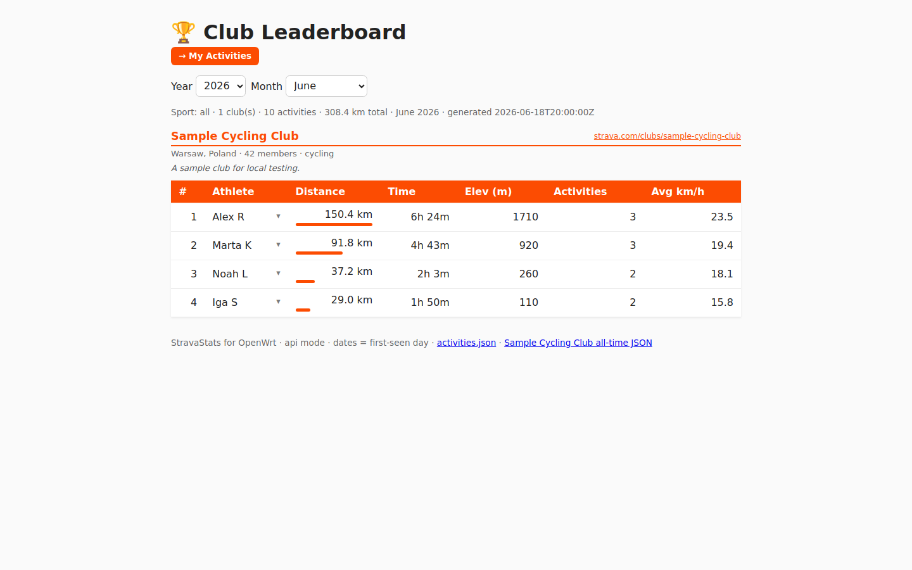
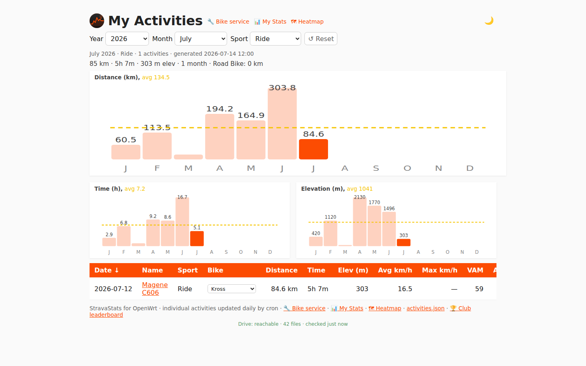
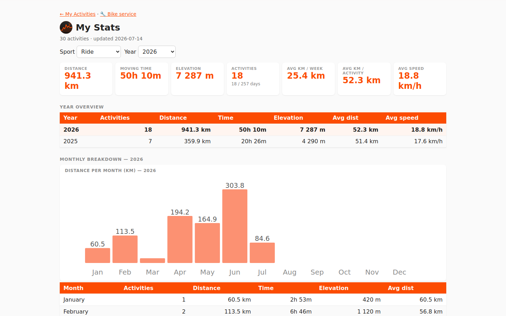
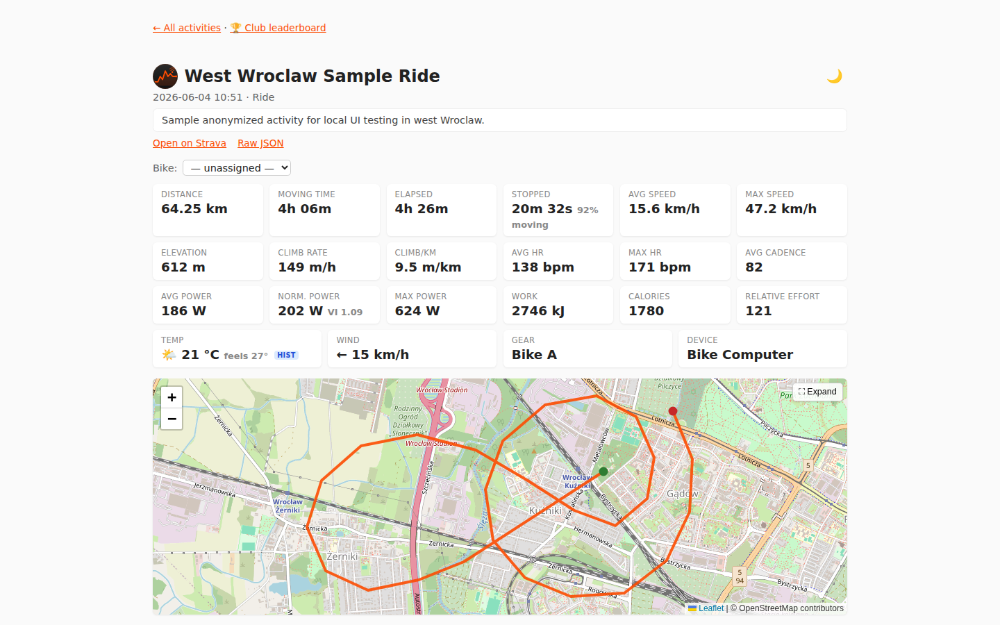
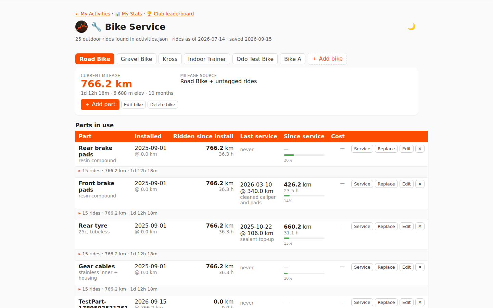

# StravaStats for OpenWrt
[](https://github.com/raczeja/StatsServiceBook/actions/workflows/ci.yml)
[](https://hub.docker.com/r/jraczek/statsservicebook)

A router-native activity stats and bike service tracker for OpenWrt. A single POSIX shell script driven by cron uses `curl` and `jq` to fetch activity data, then writes static HTML and JSON into uhttpd's web root — no extra daemon, almost no RAM. Three data sources are supported; the router's built-in web server serves everything. Can also run locally via Docker or Windows WSL.

## Data sources

| Source | Config file | When to use |
| ------ | ----------- | ----------- |
| **Strava API** (OAuth) | `/etc/strava-my-activities.conf` | You have a Strava API subscription. See [Data-Source-Strava-API](https://github.com/raczeja/StatsServiceBook/wiki/Data-Source-Strava-API) |
| **Strava scrape mode** | `/etc/strava-my-activities.conf` (`STRAVA_MY_SOURCE=scrape`) | No subscription — uses the browser session cookie. See [Data-Source-Scrape-Mode](https://github.com/raczeja/StatsServiceBook/wiki/Data-Source-Scrape-Mode) |
| **HealthSync / Google Drive** | `/etc/healthsync-activities.conf` | Fully Strava-API-free — [healthsync.app](https://healthsync.app/) exports to Drive. See [Data-Source-HealthSync](https://github.com/raczeja/StatsServiceBook/wiki/Data-Source-HealthSync) |

## Pages

| Page | URL | What it shows |
| ---- | --- | ------------- |
| **Club leaderboard** | `/strava/` | Monthly/yearly distance ranking for your Strava club, filterable by year and month |
| **My Activities** | `/strava/me/` | Sortable activity table with year/month/sport filters, bests strip, and monthly bar charts |
| **Activity detail** | `/strava/me/activity.html` | Stat cards, interactive route map (Leaflet + OSM), per-km splits, elevation, HR, cadence charts |
| **Personal stats** | `/strava/me/stats.html` | Aggregate KPIs, year-over-year heatmap, personal records, sport breakdown, day-of-week chart |
| **Bike service** | `/strava/me/bike.html` | Maintenance log per bike: parts, service types with km/hour/calendar thresholds, auto-mileage |

## Features

**My Activities dashboard**
- Sortable table: distance, time, elevation, avg/max speed, VAM, avg HR, avg power, work (kJ)
- Year/month/sport-type filters; period "bests" strip (longest, most climbing, fastest, best VAM, most work)
- Monthly bar charts for distance, time, and elevation — all client-side from a single JSON file

**Activity detail**
- Interactive route map (Leaflet + OpenStreetMap), per-km splits bar chart, elevation profile, HR chart, cadence chart
- Stat cards: pace/speed, VAM, normalized power + variability index, work, calories, relative effort, gear
- Weather: temperature, feels-like, wind speed + direction, WMO code icon, precipitation — from [Open-Meteo](https://open-meteo.com/) per activity date + GPS location

**Club leaderboard**
- Month/year filter, multiple clubs (`STRAVA_CLUB_IDS`), ranked by distance with avg speed
- Accumulating store — deduplicated daily, filter back through full history

**Personal stats**
- KPI cards, year overview table, monthly breakdown chart, year-over-year km/month heatmap
- Personal records (longest, most climbing, fastest, best VAM, most work), sport breakdown, day-of-week chart

**Bike service tracker**
- Parts with multiple named service types, each with independent km / riding-hours / calendar-time thresholds
- Mileage auto-computed from `activities.json` rides; gear mapping per bike; calendar picker for any date
- Replace flow: old part moves to Archived with final mileage + calendar duration; successor fitted on same day
- Saves via a small CGI — daily cron never touches your data

**Data management**
- Historical sync: renamed rides, corrected sport types, deleted activities all reflected automatically
- Per-activity detail backfill: fetches full activity JSON (`/activities/{id}`) gradually over nightly runs
- Scrape mode: auto-exports GPX per activity; cookie health banner (green/amber/red) shows renewal status
- HealthSync + Magene dual-source: watch HR merged with wheel-sensor distance from Magene FIT files

Full feature details: [Features](https://github.com/raczeja/StatsServiceBook/wiki/Features)

## Screenshots

| Club dashboard | My Activities dashboard |
| :------------: | :---------------------: |
|  |  |

| Personal stats | Activity detail (map + splits) | Bike service tracker |
| :------------: | :----------------------------: | :------------------: |
|  |  |  |

> Screenshots generated from sample data via `powershell -File test/make-screenshots.ps1`.

## Quick start

**1. Install on the router** (run from the repo root on your PC):

```powershell
scp -r . root@192.168.1.1:/tmp/strava
ssh root@192.168.1.1 sh /tmp/strava/install.sh
```

**2. Edit the config** (choose one data source):

```sh
vi /etc/strava-my-activities.conf     # Strava API or scrape mode
# — or —
vi /etc/healthsync-activities.conf    # HealthSync / Google Drive
```

**3. Run once to verify:**

```sh
strava-my-activities      # (or: healthsync-activities)
strava-leaderboard
```

A healthy run ends with `done.`. Any `ERROR:` line means the run aborted — check credentials.

**4. Browse:**
- My Activities: `http://<router-ip>/strava/me/`
- Club leaderboard: `http://<router-ip>/strava/`

**5. Cron is already installed** (23:50 leaderboard, 23:55 my-activities, Warsaw time). Check with `crontab -l`.

For full install options, path variables, and post-install verification see [Installation](https://github.com/raczeja/StatsServiceBook/wiki/Installation).

## Docker Hub

The easiest way to run StatsServiceBook on any machine (Linux, Mac, Windows, Raspberry Pi):

```sh
# 1. Copy and fill in config template(s):
cp docker/strava-my-activities.conf.example my-activities.conf
# edit my-activities.conf — add CLIENT_ID / CLIENT_SECRET / REFRESH_TOKEN

# Optional: club leaderboard
cp docker/strava-leaderboard.conf.example leaderboard.conf
# edit leaderboard.conf — add CLIENT_ID / CLIENT_SECRET / REFRESH_TOKEN / CLUB_IDS

# Optional: HealthSync / Google Drive (Strava-API-free)
# cp docker/healthsync-activities.conf.example healthsync.conf

# 2. Start:
docker compose up -d

# 3. Open http://localhost/strava/me/
```

Or without compose:

```sh
docker run -d --name statsservicebook \
  -p 80:80 \
  -v "$(pwd)/my-activities.conf:/etc/strava-my-activities.conf:ro" \
  -v statsservicebook_data:/data \
  -e TZ=Europe/Warsaw \
  -e RUN_ON_START=1 \
  jraczek/statsservicebook:latest
```

Supported architectures: `amd64`, `arm64`, `arm/v7` (Raspberry Pi).
Full setup, config options, and docker-compose reference: [Docker](https://github.com/raczeja/StatsServiceBook/wiki/Docker).

## Running locally (Docker / WSL)

Quick preview with sample data — no credentials needed:

```sh
podman build -f test/Containerfile -t stravame-test .
podman run --rm -p 8080:8080 stravame-test
# Open http://localhost:8080/strava/me/
```

Run functional tests:

```powershell
powershell -ExecutionPolicy Bypass -File .\test\run-tests.ps1
```

Full instructions for running with real credentials, HealthSync, or Windows WSL: [Running-Locally](https://github.com/raczeja/StatsServiceBook/wiki/Running-Locally).

## Requirements

- OpenWrt 21.02+ on the router, SSH access as `root`
- Free space for `curl`, `jq`, `ca-bundle` (~1–2 MB); use [extroot](https://openwrt.org/docs/guide-user/additional-software/extroot_configuration) on tight 128 MB flash
- A Strava account that is a member of the club you want to rank (for club leaderboard)
- Node.js ≥ 18 and PowerShell Core (`pwsh`) for running the test suite locally

## Documentation

| Wiki page | Contents |
| --------- | -------- |
| [Home](https://github.com/raczeja/StatsServiceBook/wiki) | Index of all wiki pages |
| [Features](https://github.com/raczeja/StatsServiceBook/wiki/Features) | Detailed description of every feature across all five pages |
| [Installation](https://github.com/raczeja/StatsServiceBook/wiki/Installation) | Full install guide, path variables, scheduling, verification |
| [Data-Source-Strava-API](https://github.com/raczeja/StatsServiceBook/wiki/Data-Source-Strava-API) | Create Strava app, one-time OAuth, token handling |
| [Data-Source-Scrape-Mode](https://github.com/raczeja/StatsServiceBook/wiki/Data-Source-Scrape-Mode) | My Activities scrape mode, Club leaderboard scrape mode, session cookie |
| [Data-Source-HealthSync](https://github.com/raczeja/StatsServiceBook/wiki/Data-Source-HealthSync) | Google Drive OAuth, HealthSync setup, Magene FIT, dual-source detection |
| [Docker](https://github.com/raczeja/StatsServiceBook/wiki/Docker) | Docker Hub quick start, config templates, docker-compose, publishing |
| [Running-Locally](https://github.com/raczeja/StatsServiceBook/wiki/Running-Locally) | Docker preview, real-data Docker, WSL, HealthSync local test |
| [Email-Notifications](https://github.com/raczeja/StatsServiceBook/wiki/Email-Notifications) | Monthly leaderboard email, cron error alerts, Gmail App Password |
| [Upgrading](https://github.com/raczeja/StatsServiceBook/wiki/Upgrading) | Binary-only scp deploy, full reinstall, surviving sysupgrade |
| [Switching-Data-Sources](https://github.com/raczeja/StatsServiceBook/wiki/Switching-Data-Sources) | API → scrape mode, Strava → HealthSync migration steps |
| [Operations](https://github.com/raczeja/StatsServiceBook/wiki/Operations) | Full file/URL reference, limitations, rate limits |
